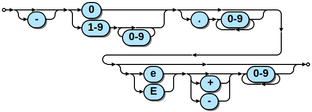

# jsyntrax

[](https://github.com/atp-mipt/jsyntrax/actions?query=workflow%3A"build")

JSyntrax is a railroad diagrams generator. 
It creates a visual illustration of the grammar used for programming languages. A specification file describes the syntax as a hierarchy of basic elements. 
This is processed into an image representing the same syntax with interconnected bubbles.

The specification is a set of nested Groovy function calls:

```groovy
indentstack(10,
  line(opt('-'), choice('0', line('1-9', loop(None, '0-9'))),
    opt('.', loop('0-9', None))),
  line(opt(choice('e', 'E'), choice(None, '+', '-'), loop('0-9', None)))
)
```

This is processed by JSyntrax to generate an SVG image:



JSyntrax renders SVG vector images. The SVG output can have hyperlinked text allowing users to quickly navigate to documentation of different syntax elements.

This is a Java reimplementation of [syntrax](https://github.com/kevinpt/syntrax/) project, originally written in Python. 

The aim of this project is to make `syntrax` tool easy to install on any operating system (no software is required for `jsyntrax` besides Java 11).

See [documentation](https://atp-mipt.github.io/jsyntrax/).